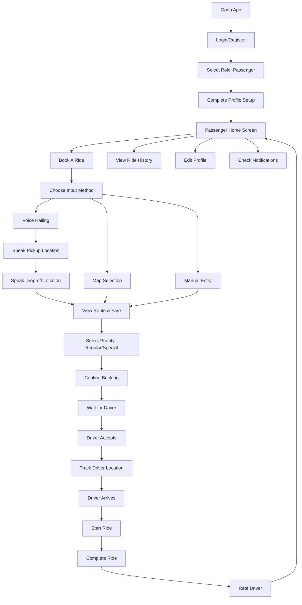
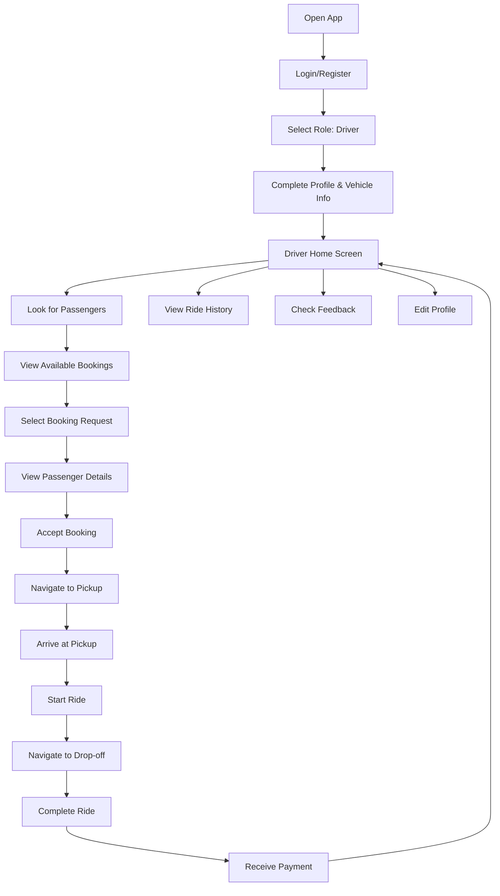

# 🚖 TriGoRide - Comprehensive Documentation

<div align="center">


**Oroquieta City Based Tricycle Booking Application**

[](https://flutter.dev)
[](https://firebase.google.com)
[](https://dart.dev)
[](LICENSE)

_A modern, intelligent tricycle booking platform connecting passengers and drivers in Oroquieta City_

[Features](#-core-features) • [Architecture](#-application-architecture) • [Build](#-build-configuration) • [Installation](#-installation)

</div>

---

## 📋 Table of Contents

- [Overview](#-overview)
- [Core Features](#-core-features)
- [Technology Stack](#-technology-stack)
- [Application Architecture](#-application-architecture)
- [Project Structure](#-project-structure)
- [Key Components](#-key-components)
- [Services & Integrations](#-services--integrations)
- [Build Configuration](#-build-configuration)
- [Installation & Setup](#-installation--setup)
- [User Flows](#-user-flows)
- [Security Features](#-security-features)
- [Future Enhancements](#-future-enhancements)

---

## 🌟 Overview

**TriGoRide** is a comprehensive, location-based tricycle booking application specifically designed for Oroquieta City. The app serves two distinct user roles:

### 👥 Dual-Role System

#### **Passengers**

- Book tricycle rides with real-time driver matching
- Voice-activated booking system for hands-free operation
- Track rides in real-time with Google Maps integration
- Rate and review drivers after each trip
- View complete ride history and booking status

#### **Drivers (Riders)**

- Accept booking requests from passengers
- Navigate to pickup and drop-off locations
- Manage availability status
- View earnings and ride history
- Receive real-time notifications for new bookings

---

## ✨ Core Features

### 🎤 **Voice Hailing System**

An innovative **speech-to-text** powered booking interface that allows passengers to book rides using voice commands.

**Key Capabilities:**

- **Two-phase voice input**: Pickup location → Drop-off location
- **Real-time audio visualization** with animated waveforms
- **Sound level monitoring** for optimal speech recognition
- **Automatic retry logic** for failed recognition
- **Visual progress indicators** showing booking phases
- **8-second listening windows** with partial results

**Technical Implementation:**

```dart
speech_to_text: ^7.1.0  // Core speech recognition
```

**Features:**

- Noise-adaptive recognition
- Landmark-based location parsing
- Multi-language support ready
- Animated UI feedback with pulse effects
- Custom waveform painter for audio visualization

---

### 🗺️ **Advanced Mapping & Routing**

**Google Maps Integration:**

- Real-time location tracking with **Geolocator**
- Interactive map interface with custom markers
- **Polyline route visualization** between pickup and drop-off
- **Smart camera positioning** with automatic bounds fitting
- **Driver location tracking** included in map bounds
- Distance calculation and dynamic zoom levels
- Nearby places API integration for location names

**Map View Enhancements:**

- **300ms delay** before camera animation for smooth transitions
- **100px padding** around routes for better visibility
- **Blue polyline** for clear route indication
- **Auto-fit bounds** on map creation when routes exist
- **Driver position included** in bounds calculation for active rides

**Route Optimization:**

```dart
google_maps_flutter: ^2.5.1
flutter_polyline_points: ^2.1.0
geolocator: ^10.1.0
geocoding: ^2.0.5
```

**Smart Features:**

- Auto-zoom based on route distance (<1km: zoom 16, >50km: zoom 8)
- Place name resolution for coordinates
- Establishment-based location identification
- Real-time driver location updates
- Centered map view on polyline and markers

---

### 📱 **Push Notifications System**

**Firebase Cloud Messaging (FCM) Integration:**

- Real-time booking notifications for drivers
- Ride status updates for passengers
- System-wide announcements
- Local notifications with sound and vibration

**Notification Categories:**

- 🚖 **Booking notifications**: New ride requests
- 📍 **Location updates**: Driver approaching, arrived
- ⭐ **Rating reminders**: Post-ride feedback
- 💰 **Payment confirmations**: Ride completions
- 🎉 **Promotions**: Special offers and updates

**Implementation:**

```dart
firebase_messaging: ^15.2.5
flutter_local_notifications: ^19.1.0
timezone: ^0.10.0
googleapis_auth: ^2.0.0
```

---

### 🤖 **Machine Learning Integration**

**TensorFlow Lite Model:**

```
assets/heuristic_model.tflite
```

**Capabilities:**

- Predictive fare estimation
- Route optimization suggestions
- Demand forecasting
- Driver-passenger matching optimization

**Package:**

```dart
tflite_flutter: ^0.11.0
```

---

### 📧📱 **Multi-Channel Notifications**

**Comprehensive notification system using three channels:**

#### **Push Notifications (FCM)**

- Real-time in-app notifications
- Background message handling
- Custom notification channels
- Badge counters and sounds

#### **SMS Notifications (Semaphore API)**

- **Trigger:** When driver accepts booking
- **Recipient:** Passenger
- **Content:** Driver name, pickup location, booking status
- **Format:** Plain text message
- **Delivery:** Instant via Semaphore Philippines

**Example SMS:**

```
Hello John!

Your ride has been accepted by Miguel Santos.

Pickup: City Hall, Oroquieta

Driver is on the way. Track your ride in the TriGoRide app.

- TriGoRide Team
```

#### **Email Notifications (SendGrid API)**

- **Trigger:** When ride is completed
- **Recipient:** Passenger
- **Content:** Full trip receipt with details
- **Format:** Professional HTML email with branding
- **Features:**
  - Trip summary with booking ID
  - Driver information
  - Pickup and drop-off locations
  - Fare breakdown
  - Call-to-action button
  - TriGoRide branding

**Email Receipt Preview:**

```
Subject: 🚖 Your TriGoRide Trip Receipt - Booking #ABC123

Hi John Doe,

Thank you for riding with TriGoRide! Your trip has been completed successfully.

━━━━━━━━━━━━━━━━━━━━━━━━━━━━━━━━━━
Booking ID:     ABC123
Driver:         Miguel Santos
From:           City Hall, Oroquieta
To:             Public Market
Fare:           ₱50.00
━━━━━━━━━━━━━━━━━━━━━━━━━━━━━━━━━━

We hope you had a great experience!
Don't forget to rate your driver in the app.

[View Ride History Button]
```

**Technical Implementation:**

```dart
// services/noti_services.dart

// SMS via Semaphore
Future<bool> sendSMS({
  required String phoneNumber,
  required String message,
}) async {
  // POST to https://api.semaphore.co/api/v4/messages
  // Handles Philippine number formats automatically
  // Returns success/failure status
}

// Email via SendGrid
Future<bool> sendEmail({
  required String toEmail,
  required String subject,
  required String htmlBody,
  String? plainTextBody,
}) async {
  // POST to https://api.sendgrid.com/v3/mail/send
  // Supports both HTML and plain text
  // Professional email templates
}

// High-level convenience methods
sendBookingAcceptedSMS(...)
sendRideCompletionEmail(...)
```

**Configuration:**

```env
# .env file
SEMAPHORE_API_KEY=your_key_here
SENDGRID_API_KEY=your_key_here
SENDGRID_FROM_EMAIL=noreply@trigoride.com
SENDGRID_FROM_NAME=TriGoRide
```

**Features:**

- ✅ Automatic phone number format handling (PH)
- ✅ HTML and plain text email versions
- ✅ Graceful fallback if APIs unavailable
- ✅ Console logging for debugging
- ✅ Error handling with try-catch
- ✅ API key validation

**Setup Guide:** See `SMS_EMAIL_SETUP.md` for detailed configuration instructions.

---

### 💰 **Smart Fare Calculation**

**Dynamic Pricing System:**

- **Per-head pricing for normal rides**: Fare multiplies by passenger count

  - Formula: `(base fare + service fee) × passenger count`
  - Example: ₱18 base + ₱1.80 fee = ₱19.80 per person
  - 3 passengers = ₱19.80 × 3 = ₱59.40 total

- **Flat rate for special rides**: Not per-head with minimum enforcement
  - Minimum fare: ₱60.00
  - User-entered amount (if above minimum)
  - Same price regardless of passenger count

**Fare Components:**

```dart
Base Fare: ₱15 minimum + (distance/2000m × ₱1.50)
Service Fee: 10% of base fare
Total (Normal): (Base + Service Fee) × Passenger Count
Total (Special): Max(Entered Amount, ₱60.00)
```

**Features:**

- Real-time fare calculation as route changes
- Distance-based pricing using Google Maps Directions API
- Service fee transparency
- Special booking premium option
- Passenger count adjustment

---

### 🎨 **Enhanced Booking Cards**

**Driver View (Passenger Search Screen):**

- **Passenger information** with styled status badge
- **Pickup & dropoff addresses** with location icons
- **Passenger count** displayed with people icon
- **Fare amount** shown in Philippine pesos (₱)
- **Priority badge** for special bookings
- **Decline button** with proper UI state management
- **Accept button** for quick booking confirmation

**Driver View (Active Ride Screen):**

- **Enhanced card UI** with complete trip details
- **Passenger name** with color-coded status badge
- **Date & time** with clock icon
- **Pickup location** with pin icon
- **Dropoff location** with flag icon
- **Passenger count & fare** displayed side-by-side
- **Call button** for direct passenger contact
- **Complete ride button** for trip finalization

**UI Components:**

```dart
_buildInfoRow() helper method for consistent info display:
- Icon (18px, theme color)
- Label (bold)
- Value (flexible width with ellipsis overflow)
```

---

### 🔐 **User-Friendly Error Handling**

**Authentication Error Messages:**

Instead of raw Firebase errors, users see clear, actionable messages:

**Login Errors:**

- ❌ `user-not-found` → "No account found with this email address."
- ❌ `wrong-password` → "Incorrect password. Please try again."
- ❌ `invalid-email` → "Invalid email address format."
- ❌ `user-disabled` → "This account has been disabled."
- ❌ `too-many-requests` → "Too many failed login attempts. Please try again later."
- ❌ `invalid-credential` → "Invalid email or password. Please check your credentials."
- ❌ `network-request-failed` → "Network error. Please check your internet connection."

**Registration Errors:**

- ❌ `email-already-in-use` → "An account with this email already exists."
- ❌ `weak-password` → "Password is too weak. Please use at least 6 characters."
- ❌ `invalid-email` → "Invalid email address format."
- ❌ `operation-not-allowed` → "Email/password accounts are not enabled."
- ❌ `network-request-failed` → "Network error. Please check your internet connection."

**Affected Screens:**

- `login_screen.dart` - Passenger & Driver login
- `register_passenger.dart` - Passenger registration
- `register_driver.dart` - Driver registration & login

---

### ⭐ **Rating & Review System**

**Comprehensive Feedback Mechanism:**

**Passenger Features:**

- Rate drivers on a 5-star scale
- Written review submission
- View past ratings given
- Anonymous feedback option

**Driver Features:**

- View aggregate ratings and statistics
- Read passenger reviews
- Track rating trends over time
- Respond to feedback

**Data Model:**

```dart
// models/rating.dart
class Rating {
  String driverId;
  String passengerId;
  double rating;
  String comment;
  Timestamp timestamp;
  String bookingId;
}
```

**Service Layer:**

```dart
// services/rating_service.dart
- submitRating()
- fetchDriverRatings()
- calculateAverageRating()
- getRatingHistory()
```

---

### 🔐 **Authentication System**

**Multi-Provider Authentication:**

**Supported Methods:**

1. **Email/Password**: Traditional authentication
2. **Google Sign-In**: OAuth integration
3. **Firebase Authentication**: Secure token management

**Security Features:**

- Encrypted password storage
- Session management with automatic token refresh
- Role-based access control (Passenger/Driver)
- Profile verification system

**Implementation:**

```dart
firebase_auth: ^5.3.4
google_sign_in: ^6.2.2
```

**User Flow:**

1. **Registration**: Choose role → Enter details → Verify email
2. **First-time setup**: Profile completion with photo upload
3. **Login**: Email/Google → Dashboard redirect based on role
4. **Session**: Auto-login with stored credentials

---

### 🌓 **Adaptive Theming**

**Dynamic Theme System:**

**Light Mode:**

- Clean white backgrounds
- Orange primary color (#FF9800)
- High contrast for outdoor visibility
- Material Design 2 components

**Dark Mode:**

- AMOLED-friendly dark gray (#121212)
- Orange accent preservation
- Reduced eye strain for night usage
- Automatic system theme detection

**Implementation:**

```dart
ThemeMode.system  // Auto-detects device preference
useMaterial3: false  // Classic Material Design
```

**Theme Features:**

- Seamless transitions between modes
- Preserved color scheme across themes
- Custom AppBar styling per mode
- Adaptive text colors for readability

---

### 📸 **Media Management**

**Cloudinary Integration:**

**Features:**

- Profile photo uploads
- Image optimization and transformation
- CDN-powered delivery
- Automatic format conversion (WebP, PNG)
- Circular avatar cropping with transformations

**Configuration:**

```dart
cloudinary_flutter: ^1.0.0
cloudinary_url_gen: ^1.0.0

CloudinaryObject.fromCloudName(cloudName: 'dm1zumkxl')

// Transformation pipeline
Transformation()
  ..addTransformation('ar_1.0,c_fill,w_100/r_max/f_png')
```

**Image Operations:**

- **Upload**: Gallery/Camera selection
- **Transform**: Auto-crop to 1:1 aspect ratio
- **Optimize**: Responsive sizing (w_100 for avatars)
- **Cache**: CDN-based global distribution

**Local Image Picker:**

```dart
image_picker: ^1.0.4
```

---

### 📞 **Communication Features**

**Direct Calling:**

```dart
flutter_phone_direct_caller: ^2.1.0
```

**Functionality:**

- Tap-to-call driver from booking screen
- Emergency contact calling
- In-app dialer with permission handling

**URL Launcher:**

```dart
url_launcher: ^6.3.1
```

**Supported Actions:**

- Phone calls: `tel:`
- SMS: `sms:`
- Email: `mailto:`
- Web links: `https://`
- Maps: `geo:` coordinates

---

### 📊 **Real-time Data Management**

**Cloud Firestore Collections:**

#### **Users Collection**

```json
{
  "email": "user@example.com",
  "username": "John Doe",
  "role": "passenger | driver",
  "fcmToken": "fcm_token_string",
  "profileImage": {
    "publicId": "cloudinary_id",
    "url": "https://..."
  },
  "createdAt": "Timestamp",
  "phone": "+639123456789"
}
```

#### **Bookings Collection**

```json
{
  "bookingId": "unique_id",
  "passenger": "passenger_name",
  "passengerId": "passenger_email",
  "driver": "driver_name | null",
  "driverId": "driver_email | null",
  "pickUpLocation": {
    "lat": 8.4833,
    "lng": 123.8,
    "address": "City Hall, Oroquieta"
  },
  "dropOffLocation": {
    "lat": 8.49,
    "lng": 123.81,
    "address": "Public Market"
  },
  "fare": 50.0,
  "priority": "regular | special",
  "status": "pending | accepted | ongoing | completed | cancelled",
  "active": true,
  "createdAt": "Timestamp",
  "completedAt": "Timestamp | null"
}
```

#### **Notifications Collection**

```json
{
  "userId": "user_email",
  "message": "Your ride has been accepted!",
  "type": "booking | payment | system | promotion",
  "timestamp": "Timestamp",
  "read": false,
  "bookingId": "related_booking_id | null"
}
```

#### **Ratings Collection**

```json
{
  "driverId": "driver_id",
  "passengerId": "passenger_id",
  "bookingId": "booking_id",
  "rating": 4.5,
  "comment": "Great driver!",
  "timestamp": "Timestamp"
}
```

**Real-time Features:**

- Live booking status updates
- Driver location streaming
- Instant notification delivery
- Ride history synchronization

---

## 🏗️ Technology Stack

### **Frontend Framework**

```yaml
Flutter SDK: ^3.6.0
Dart SDK: ^3.6.0
```

### **Backend Services**

- **Firebase Authentication**: User management
- **Cloud Firestore**: NoSQL database
- **Firebase Cloud Messaging**: Push notifications
- **Firebase Analytics**: Usage tracking

### **Third-Party APIs**

- **Google Maps Platform**
  - Maps SDK
  - Directions API
  - Places API (Nearby Search)
  - Geocoding API
- **Cloudinary**: Image CDN
- **Google OAuth**: Sign-in service

### **Key Dependencies**

#### **Core**

```yaml
firebase_core: ^3.9.0
firebase_auth: ^5.3.4
cloud_firestore: ^5.6.6
firebase_messaging: ^15.2.5
```

#### **Maps & Location**

```yaml
google_maps_flutter: ^2.5.1
geolocator: ^10.1.0
geocoding: ^2.0.5
location: ^5.0.3
flutter_polyline_points: ^2.1.0
```

#### **UI/UX**

```yaml
animated_bottom_navigation_bar: ^1.4.0
page_transition: ^2.2.1
flutter_svg: ^2.0.7
```

#### **AI/ML**

```yaml
tflite_flutter: ^0.11.0
speech_to_text: ^7.1.0
```

#### **Utilities**

```yaml
http: ^1.2.1
intl: ^0.20.2
flutter_dotenv: ^5.2.1
provider: ^6.1.1
mailer: ^6.1.2 # Email notifications via SendGrid
```

#### **External APIs**

- **Semaphore API**: SMS notifications (Philippines)
- **SendGrid API**: Email notifications and receipts

---

## 📁 Project Structure

```
TriGoRide/
├── android/                          # Android native configuration
│   ├── app/
│   │   ├── src/                     # Android source code
│   │   ├── build.gradle             # App-level Gradle config
│   │   └── google-services.json    # Firebase configuration
│   ├── build.gradle                 # Project-level Gradle
│   └── gradle.properties            # Gradle properties
│
├── ios/                              # iOS native configuration
│   ├── Runner/                      # iOS app container
│   └── Runner.xcodeproj/           # Xcode project
│
├── lib/                              # Main application code
│   ├── main.dart                    # App entry point
│   │
│   ├── models/                      # Data models
│   │   └── rating.dart             # Rating model
│   │
│   ├── services/                    # Business logic & APIs
│   │   ├── auth_services.dart      # Authentication service
│   │   ├── cloudinary_service.dart # Image upload service
│   │   ├── noti_services.dart      # Notification service
│   │   └── rating_service.dart     # Rating management
│   │
│   ├── ui/                          # User interface screens
│   │   ├── booking_details.dart
│   │   ├── choose_user.dart        # Role selection
│   │   ├── first_time_profile_setup.dart
│   │   ├── location_picker_screen.dart
│   │   ├── login_screen.dart
│   │   ├── register_driver.dart
│   │   ├── register_passenger.dart
│   │   ├── root_page_passenger.dart
│   │   ├── root_page_rider.dart
│   │   ├── splash_screen.dart
│   │   ├── voice_hailing.dart      # Voice booking interface
│   │   │
│   │   └── screens/
│   │       ├── notifs_page.dart
│   │       │
│   │       ├── passenger_side/
│   │       │   ├── book_ride.dart          # Main booking screen
│   │       │   ├── driver_info.dart        # Driver details view
│   │       │   ├── passenger_home_screen.dart
│   │       │   ├── passenger_profile.dart
│   │       │   ├── passenger_ride_history.dart
│   │       │   ├── rating_dialog.dart      # Rate driver
│   │       │   └── waiting_for_driver.dart
│   │       │
│   │       └── rider_side/
│   │           ├── driver_rating.dart      # View ratings
│   │           ├── passenger_search.dart   # Find passengers
│   │           ├── rider_bookings.dart
│   │           ├── rider_home_screen.dart
│   │           ├── rider_notifications.dart
│   │           ├── rider_profile.dart
│   │           ├── rider_ride_history.dart
│   │           └── rider_settings.dart
│   │
│   └── widgets/                     # Reusable components
│       ├── bottom_nav_bar.dart     # Passenger nav
│       └── bottom_nav_bar_rider.dart # Driver nav
│
├── assets/                           # Static resources
│   ├── tricycle.png
│   ├── TriGoRideLogo.png
│   ├── heuristic_model.tflite      # ML model
│   ├── service-account.json        # Firebase admin
│   └── (various icons)
│
├── build/                            # Build artifacts
│   ├── app/                         # Compiled app
│   ├── cloud_firestore/            # Plugin builds
│   ├── firebase_auth/
│   ├── firebase_messaging/
│   └── (other plugin builds)
│
├── test/                             # Unit & widget tests
│   └── widget_test.dart
│
├── web/                              # Web platform support
│   ├── index.html
│   └── manifest.json
│
├── windows/                          # Windows platform
├── linux/                            # Linux platform
├── macos/                            # macOS platform
│
├── pubspec.yaml                      # Dependencies & assets
├── analysis_options.yaml             # Linter rules
├── flutter_launcher_icons.yaml      # App icon config
├── .env                              # Environment variables
└── README.md                         # Project readme

```

---

## 🔧 Key Components

### **1. Main Application (`main.dart`)**

**Responsibilities:**

- Firebase initialization
- FCM token registration
- Environment variable loading (.env)
- Theme configuration (Light/Dark)
- Notification service initialization
- CloudinaryObject setup
- App routing configuration

**Key Code:**

```dart
Future<void> main() async {
  WidgetsFlutterBinding.ensureInitialized();
  SystemChrome.setEnabledSystemUIMode(
    SystemUiMode.manual,
    overlays: SystemUiOverlay.values,
  );

  await Firebase.initializeApp();
  final authService = AuthService();
  await authService.initFCM();
  await dotenv.load();
  await NotiService().init();
  runApp(const MyApp());
}
```

---

### **2. Authentication Service (`auth_services.dart`)**

**Core Methods:**

```dart
class AuthService {
  final FirebaseAuth _auth;
  final FirebaseFirestore firestore;
  final FirebaseMessaging _fcm;

  // Authentication
  Future<User?> signIn(String email, String password)
  Future<User?> register(String email, String password)
  Future<void> signOut()
  User? getUser()

  // FCM Management
  Future<void> initFCM()  // Request permissions & save token

  // Token Management
  Future<String> getAccessToken()  // For Firebase Admin SDK
  Future<String?> getIdToken({bool forceRefresh = false})

  // State Monitoring
  Stream<User?> get authStateChanges
}
```

**Security Features:**

- Service account authentication
- Google OAuth scopes
- Auto token refresh
- Secure credential storage

---

### **3. Notification Service (`noti_services.dart`)**

**Capabilities:**

- Initialize local notifications
- Configure notification channels
- Handle foreground/background messages
- Schedule notifications with timezone support
- Display rich notifications with actions

**Channel Configuration:**

```dart
AndroidNotificationChannel(
  'booking_channel',
  'Booking Notifications',
  description: 'Notifications for ride bookings',
  importance: Importance.high,
)
```

---

### **4. Book Ride Screen (`book_ride.dart`)**

**Features:**

- **Location Selection**: Map-based or voice input
- **Route Visualization**: Polyline rendering
- **Fare Calculation**: Distance-based pricing
- **Priority Booking**: Regular vs. Special (higher fare)
- **Driver Matching**: Real-time availability check
- **Booking Confirmation**: Firestore transaction

**Workflow:**

1. Select pickup location (map/voice/manual)
2. Select drop-off location
3. View route and estimated fare
4. Choose priority level
5. Confirm booking
6. Wait for driver acceptance
7. Track driver arrival
8. Complete ride
9. Rate driver

**Smart Zoom Algorithm:**

```dart
double _getZoomLevel() {
  final d = _distanceKm;
  if (d < 1) return 16;   // Neighborhood level
  if (d < 5) return 14;   // District level
  if (d < 10) return 13;  // City level
  if (d < 20) return 12;  // Regional level
  if (d < 50) return 10;  // Provincial level
  return 8;               // Wide area
}
```

---

### **5. Voice Hailing (`voice_hailing.dart`)**

**UI Components:**

**Header Section:**

- Dynamic title based on phase
- Contextual subtitle with tips
- Role-specific instructions

**Progress Indicator:**

- Two-step visual progress (Pickup → Drop-off)
- Icon-based phase representation
- Color-coded completion states

**Waveform Visualization:**

- Custom painter with sound level mapping
- Multi-frequency wave combination
- Gradient opacity effects
- Real-time animation at 1200ms cycle

**Microphone Button:**

- Pulsing glow effect during listening
- Stop/Start toggle functionality
- Shadow animation synchronized with sound

**Custom Painter:**

```dart
class ModernWaveformPainter extends CustomPainter {
  // 4px bars with 3px spacing
  // Multi-wave frequency combination
  // Sound level normalization (0-60 dB)
  // Gradient opacity from center outward
  // Smooth bar height interpolation
}
```

---

### **6. Passenger Home Screen**

**Dashboard Sections:**

1. **Welcome Header**

   - Profile greeting with username
   - Notification bell icon
   - Orange accent container

2. **Quick Actions Grid** (2x2)

   - 📍 **Book A Ride**: Navigate to booking
   - 📜 **Ride History**: View past trips
   - 👤 **Profile**: Edit account settings
   - 🚪 **Logout**: Sign out

3. **Recent Activity Feed**
   - Last 3 notifications
   - Real-time Firestore stream
   - Formatted timestamps (MMM dd, yyyy h:mm a)
   - Type-based icons (booking, profile, promotion)

---

### **7. Rider Home Screen**

**Dashboard Layout:**

1. **Profile Header**

   - Cloudinary circular avatar
   - Welcome message
   - Notification icon

2. **Action Grid**

   - 🔍 **Look for Passengers**: Browse requests
   - 📖 **Ride History**: View completed trips
   - ⭐ **Feedback**: View ratings & reviews
   - 👤 **Profile**: Manage account

3. **Recent Activity**
   - Last 2 notifications
   - Booking/payment/system alerts
   - Time-based formatting (h:mm a)

---

### **8. Rating Dialog**

**Components:**

- **Star Rating Widget**: Interactive 1-5 scale
- **Comment TextField**: Optional written feedback
- **Submit Button**: Save to Firestore
- **Skip Option**: Dismiss without rating

**Data Flow:**

```
Passenger → Rating Dialog → rating_service.dart → Firestore
                                ↓
                          Notification → Driver
```

---

## 🌐 Services & Integrations

### **Firebase Services**

#### **Authentication**

- **Email/Password**: Native Firebase Auth
- **Google Sign-In**: OAuth 2.0 flow
- **Token Management**: Auto-refresh on expiry
- **Session Persistence**: Secure local storage

#### **Cloud Firestore**

- **Real-time Sync**: Live updates via streams
- **Offline Support**: Local cache for poor connectivity
- **Compound Queries**: Multi-field filtering
- **Security Rules**: Role-based access control

#### **Cloud Messaging (FCM)**

- **Device Tokens**: Stored per user in Firestore
- **Topic Subscriptions**: Role-based broadcasts
- **Data Payloads**: Custom notification data
- **Background Handlers**: Process messages when app closed

---

### **Google Maps Platform**

#### **Maps SDK for Flutter**

```dart
google_maps_flutter: ^2.5.1
```

**Features Used:**

- Interactive map widget
- Custom markers (pickup/drop-off)
- Polyline overlays
- Camera controls (position, zoom, tilt)
- Gesture handling (pan, zoom, rotate)

#### **Directions API**

```dart
google_directions_api: ^0.10.0
```

**Purpose:**

- Calculate optimal route
- Get turn-by-turn directions
- Estimate travel time
- Calculate distance

#### **Places API (Nearby Search)**

```http
GET https://maps.googleapis.com/maps/api/place/nearbysearch/json
  ?location=LAT,LNG
  &rankby=distance
  &type=establishment
  &key=API_KEY
```

**Usage:**

- Resolve coordinates to place names
- Find nearest landmarks
- Autocomplete location suggestions
- Validate addresses

#### **Geocoding API**

```dart
geocoding: ^2.0.5
```

**Capabilities:**

- Coordinates → Address (Reverse geocoding)
- Address → Coordinates (Forward geocoding)
- Place ID lookup

---

### **Cloudinary Media Platform**

**Configuration:**

```dart
final CloudinaryObject cloudinary =
  CloudinaryObject.fromCloudName(cloudName: 'dm1zumkxl');
```

**Image Transformations:**

```
ar_1.0        // Aspect ratio 1:1 (square)
c_fill        // Fill mode (crop to fit)
w_100         // Width 100px
r_max         // Maximum rounding (circular)
f_png         // Format PNG
```

**Use Cases:**

- Profile picture uploads
- Vehicle photo management
- Document verification images
- Proof of trip photos

**Optimization:**

- Automatic WebP conversion for supported browsers
- Lazy loading for fast page loads
- Responsive images based on device
- Global CDN distribution

---

### **TensorFlow Lite Model**

**Model File:**

```
assets/heuristic_model.tflite
```

**Potential Applications:**

- **Fare Prediction**: Based on distance, time, traffic
- **Route Optimization**: Fastest path recommendation
- **Demand Forecasting**: Peak hour predictions
- **Driver Matching**: Optimal driver-passenger pairing
- **ETA Estimation**: Arrival time calculation

**Integration:**

```dart
tflite_flutter: ^0.11.0
```

**Inference Pipeline:**

1. Load model from assets
2. Prepare input tensors (normalized data)
3. Run inference
4. Interpret output tensors
5. Apply business logic

---

## 🏗️ Build Configuration

### **Android Build (`android/app/build.gradle`)**

```groovy
android {
  namespace = "com.InnoVision.tri_go_ride"
  compileSdk = 35
  ndkVersion = "27.0.12077973"

  defaultConfig {
    applicationId = "com.InnoVision.tri_go_ride"
    minSdkVersion 23    // Android 6.0 (Marshmallow)
    targetSdk = 35      // Android 15
    versionCode = 1
    versionName = "1.0.0"
  }

  compileOptions {
    sourceCompatibility = JavaVersion.VERSION_1_8
    targetCompatibility = JavaVersion.VERSION_1_8
    coreLibraryDesugaringEnabled true  // Backport Java APIs
  }

  buildTypes {
    release {
      minifyEnabled false        // Code obfuscation
      shrinkResources false      // Remove unused resources
      signingConfig = signingConfigs.debug  // TODO: Production signing
    }
  }
}

dependencies {
  // Firebase BoM - ensures version compatibility
  implementation platform('com.google.firebase:firebase-bom:33.12.0')

  // Core library desugaring for older Android versions
  coreLibraryDesugaring 'com.android.tools:desugar_jdk_libs:2.1.4'

  // Firebase services (versions managed by BoM)
  implementation 'com.google.firebase:firebase-analytics'
}
```

**Key Configurations:**

1. **Minimum SDK 23**

   - Required for modern Firebase features
   - Covers 95%+ of active Android devices
   - Supports runtime permissions model

2. **Desugaring Enabled**

   - Backports Java 8+ APIs to older Android versions
   - Enables modern language features
   - Required for some Firebase libraries

3. **NDK Version**

   - Native Development Kit for C/C++ libraries
   - Used by some Flutter plugins
   - Version 27.0.12077973 (latest stable)

4. **Firebase BoM**
   - Bill of Materials for version management
   - Ensures all Firebase libraries are compatible
   - Simplifies dependency updates

---

### **iOS Build Configuration**

**Target:** iOS 12.0+
**Architecture:** arm64 (Apple Silicon ready)
**Framework:** UIKit with Flutter embedding

**Xcode Project:**

```
ios/Runner.xcodeproj/
```

**Info.plist Permissions:**

```xml
<key>NSLocationWhenInUseUsageDescription</key>
<string>We need your location to show pickup points</string>

<key>NSLocationAlwaysUsageDescription</key>
<string>Track rides in real-time</string>

<key>NSMicrophoneUsageDescription</key>
<string>Voice booking requires microphone access</string>

<key>NSPhotoLibraryUsageDescription</key>
<string>Upload profile photos</string>

<key>NSCameraUsageDescription</key>
<string>Take profile photos</string>
```

---

### **Web Build**

**Renderer:** CanvasKit (better graphics performance)
**Assets:** Progressive Web App (PWA) ready

**manifest.json:**

```json
{
  "name": "TriGoRide",
  "short_name": "TriGoRide",
  "start_url": ".",
  "display": "standalone",
  "background_color": "#FFFFFF",
  "theme_color": "#FF9800",
  "description": "Oroquieta City Tricycle Booking",
  "orientation": "portrait-primary"
}
```

---

### **App Icons & Launcher**

**Configuration:**

```yaml
# flutter_launcher_icons.yaml
flutter_launcher_icons:
  android: true
  ios: true
  image_path: "assets/TriGoRideLogo.png"
  adaptive_icon_background: "#FF9800"
  adaptive_icon_foreground: "assets/TriGoRideLogo.png"
```

**Generate Command:**

```bash
flutter pub run flutter_launcher_icons:main
```

**Output:**

- Android: `mipmap-*dpi/ic_launcher.png` (5 densities)
- iOS: `Assets.xcassets/AppIcon.appiconset/` (all sizes)
- Adaptive icons for Android 8.0+

---

### **Environment Variables (`.env`)**

```env
# Google Maps API Key
GOOGLEMAPS_APIKEY=AIzaSy...

# Cloudinary Configuration
CLOUDINARY_CLOUD_NAME=dm1zumkxl
CLOUDINARY_API_KEY=123456789
CLOUDINARY_API_SECRET=abcdef...

# Firebase Configuration (if needed)
FIREBASE_PROJECT_ID=trigoride-12345
```

**Loading:**

```dart
await dotenv.load(fileName: ".env");
final apiKey = dotenv.get('GOOGLEMAPS_APIKEY');
```

**Security:**

- ✅ `.env` in `.gitignore`
- ✅ Separate keys per environment (dev/prod)
- ❌ Never commit API keys to version control

---

## 🚀 Installation & Setup

### **Prerequisites**

1. **Flutter SDK** (3.6.0 or higher)

   ```bash
   flutter --version
   ```

2. **Android Studio** (for Android builds)

   - Android SDK 23-35
   - NDK 27.0.12077973
   - Gradle 8.0+

3. **Xcode** (for iOS builds, macOS only)

   - Xcode 14+
   - CocoaPods

4. **Firebase Project**

   - Create project at [console.firebase.google.com](https://console.firebase.google.com)
   - Enable Authentication, Firestore, FCM
   - Download configuration files

5. **Google Cloud Project**
   - Enable Maps SDK, Directions API, Places API
   - Generate API key with restrictions

---

### **Step 1: Clone Repository**

```bash
git clone https://github.com/noneiann/TriGoRide.git
cd TriGoRide
```

---

### **Step 2: Install Dependencies**

```bash
flutter pub get
```

This installs all packages from `pubspec.yaml`.

---

### **Step 3: Configure Firebase**

#### **Android:**

1. Download `google-services.json` from Firebase Console
2. Place in `android/app/google-services.json`

#### **iOS:**

1. Download `GoogleService-Info.plist`
2. Add to `ios/Runner/` via Xcode

---

### **Step 4: Set Up Environment Variables**

Create `.env` file in project root:

```env
GOOGLEMAPS_APIKEY=YOUR_GOOGLE_MAPS_API_KEY
```

---

### **Step 5: Configure Google Maps**

#### **Android:**

Edit `android/app/src/main/AndroidManifest.xml`:

```xml
<manifest>
  <application>
    <meta-data
      android:name="com.google.android.geo.API_KEY"
      android:value="${GOOGLEMAPS_APIKEY}"/>
  </application>
</manifest>
```

#### **iOS:**

Edit `ios/Runner/AppDelegate.swift`:

```swift
import GoogleMaps

GMSServices.provideAPIKey("YOUR_API_KEY_HERE")
```

---

### **Step 6: Run the App**

#### **Debug Mode:**

```bash
flutter run
```

#### **Release Mode (Android):**

```bash
flutter build apk --release
# Output: build/app/outputs/flutter-apk/app-release.apk
```

#### **Release Mode (iOS):**

```bash
flutter build ios --release
# Then open Xcode to archive and distribute
```

---

### **Step 7: Generate App Icons**

```bash
flutter pub run flutter_launcher_icons:main
```

---

## 👥 User Flows

### **Passenger Journey**



---

### **Driver Journey**



---

## 🔒 Security Features

### **1. Firebase Security Rules**

**Firestore Rules Example:**

```javascript
rules_version = '2';
service cloud.firestore {
  match /databases/{database}/documents {

    // Users can only read/write their own data
    match /users/{userId} {
      allow read: if request.auth != null;
      allow write: if request.auth != null && request.auth.token.email == userId;
    }

    // Bookings can be read by passenger or driver
    match /bookings/{bookingId} {
      allow read: if request.auth != null && (
        resource.data.passengerId == request.auth.token.email ||
        resource.data.driverId == request.auth.token.email
      );

      allow create: if request.auth != null;

      allow update: if request.auth != null && (
        resource.data.passengerId == request.auth.token.email ||
        resource.data.driverId == request.auth.token.email
      );
    }

    // Notifications are private
    match /notifs/{notifId} {
      allow read, write: if request.auth != null &&
        resource.data.userId == request.auth.token.email;
    }
  }
}
```

---

### **2. API Key Restrictions**

**Google Maps API Key:**

- ✅ Restrict to specific APIs (Maps, Directions, Places, Geocoding)
- ✅ Restrict to app bundle ID (`com.InnoVision.tri_go_ride`)
- ✅ Set daily quota limits
- ✅ Monitor usage in Google Cloud Console

**Firebase API Key:**

- ✅ Automatically restricted to Firebase services
- ✅ Web/Android/iOS key separation
- ✅ Enable App Check for abuse prevention

---

### **3. Authentication Security**

**Password Requirements:**

- Minimum 6 characters (Firebase default)
- Can be extended with custom validation

**Token Management:**

- JWT tokens with 1-hour expiry
- Automatic refresh on expiry
- Secure storage in device keychain

**OAuth Security:**

- Google Sign-In uses OAuth 2.0
- No password stored in app
- Revocation support

---

### **4. Data Encryption**

**In Transit:**

- All Firebase connections use TLS 1.2+
- HTTPS for all API calls

**At Rest:**

- Firestore data encrypted by default
- Local device storage encrypted (iOS Keychain, Android Keystore)

---

### **5. Permission Handling**

**Runtime Permissions:**

```dart
// Location
await Geolocator.checkPermission();
await Geolocator.requestPermission();

// Microphone
final available = await _speech.initialize();

// Camera/Gallery
final image = await ImagePicker().pickImage(source: ImageSource.camera);
```

**Permission States:**

- `denied`: User denied permission
- `deniedForever`: User denied and selected "Don't ask again"
- `granted`: Permission granted
- `restricted`: System-level restriction (iOS)

---

## 🔮 Future Enhancements

### **Planned Features**

1. **💳 In-App Payments**

   - GCash/PayMaya integration
   - Credit/debit card support
   - Wallet system with top-up

2. **📊 Advanced Analytics**

   - Driver earnings dashboard
   - Passenger spending reports
   - Route popularity heatmaps
   - Peak hour visualizations

3. **🎯 Smart Matching Algorithm**

   - ML-based driver assignment
   - Optimal route suggestions
   - Predictive fare adjustment

4. **🗣️ Multi-Language Support**

   - English, Filipino, Cebuano
   - Voice recognition in local languages
   - RTL language support

5. **🚨 Safety Features**

   - SOS button with emergency contacts
   - Ride sharing with friends/family
   - Driver background verification
   - Trip monitoring by trusted contacts

6. **⭐ Loyalty Program**

   - Points for frequent rides
   - Referral bonuses
   - Discount coupons
   - VIP membership tiers

7. **🌐 Offline Mode**

   - Cached maps for offline viewing
   - Queue bookings when offline
   - Local ride history storage

8. **📹 Driver Dashcam Integration**

   - Trip video recording
   - Incident evidence
   - Live streaming for safety

9. **🤝 Corporate Accounts**

   - Business ride packages
   - Employee ride management
   - Billing and reporting

10. **📱 Smartwatch Support**
    - Quick booking from watch
    - Ride status notifications
    - Driver arrival alerts

---

## 📊 Performance Optimization

### **Current Optimizations**

1. **Image Loading**

   - Cloudinary CDN for fast delivery
   - Responsive image sizing
   - Lazy loading implementation

2. **Firestore Queries**

   - Limited results with `.limit()`
   - Indexed queries for speed
   - Pagination for large datasets

3. **Maps Performance**

   - Marker clustering for multiple drivers
   - Polyline simplification for long routes
   - Map tile caching

4. **App Size**
   - Code splitting for lazy loading
   - Asset optimization
   - Unused code elimination

---

## 🐛 Known Issues & Limitations

### **Current Limitations**

1. **Voice Recognition**

   - Requires internet connectivity
   - May struggle with heavy accents
   - Background noise interference

2. **Maps**

   - Limited offline functionality
   - Requires active data connection
   - Battery-intensive with continuous tracking

3. **Notifications**

   - Depend on FCM service availability
   - May be delayed in low-power mode
   - Android Doze mode restrictions

4. **Payment**
   - Currently manual (cash-based)
   - No digital payment integration yet

---

## 🤝 Contributing

### **Development Guidelines**

1. **Code Style**

   - Follow Dart style guide
   - Use `flutter analyze` before commits
   - Document public APIs

2. **Git Workflow**

   - Branch naming: `feature/`, `bugfix/`, `hotfix/`
   - Commit messages: Conventional Commits format
   - Pull requests: Require code review

3. **Testing**
   - Write unit tests for services
   - Widget tests for UI components
   - Integration tests for critical flows

---

## 📄 License

**Private - All Rights Reserved**

Copyright © 2025 InnoVision, TriGoRide Development Team

This application is proprietary software. Unauthorized copying, distribution, or modification is strictly prohibited.

---

## 👨‍💻 Development Team

**Organization:** InnoVision  
**Project:** TriGoRide  
**Location:** Oroquieta City, Philippines  
**Repository:** [github.com/noneiann/TriGoRide](https://github.com/noneiann/TriGoRide)

---

## 📞 Support & Contact

For technical support or inquiries:

- **Email:** support@trigoride.com
- **GitHub Issues:** [Report bugs](https://github.com/noneiann/TriGoRide/issues)
- **Documentation:** [Wiki](https://github.com/noneiann/TriGoRide/wiki)

---

## 📚 Additional Resources

### **Flutter Resources**

- [Official Flutter Documentation](https://flutter.dev/docs)
- [Dart Language Tour](https://dart.dev/guides/language/language-tour)
- [Flutter Cookbook](https://flutter.dev/docs/cookbook)

### **Firebase Resources**

- [Firebase Documentation](https://firebase.google.com/docs)
- [FlutterFire Documentation](https://firebase.flutter.dev/)
- [Firestore Best Practices](https://firebase.google.com/docs/firestore/best-practices)

### **Google Maps Resources**

- [Maps SDK for Flutter](https://pub.dev/packages/google_maps_flutter)
- [Directions API Guide](https://developers.google.com/maps/documentation/directions)
- [Places API Guide](https://developers.google.com/maps/documentation/places)

---

## 🎉 Acknowledgments

Special thanks to:

- Flutter team for the amazing framework
- Firebase team for backend infrastructure
- Google Maps Platform for location services
- Cloudinary for media management
- Open-source community for packages and support

---

<div align="center">

**TriGoRide** - _Connecting Oroquieta City, One Ride at a Time_ 🚖

[](https://flutter.dev)
[](https://firebase.google.com)

</div>
